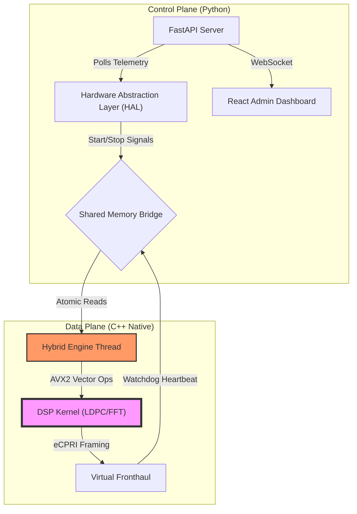
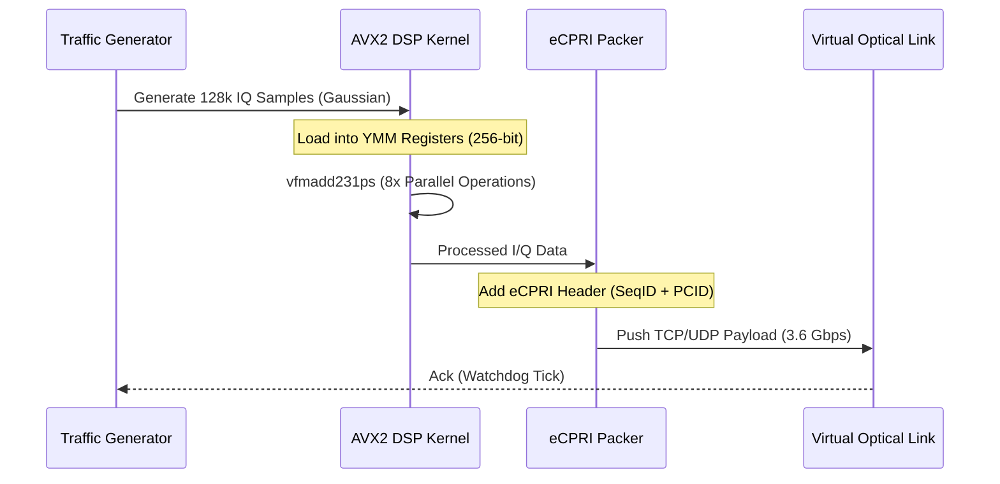

# Kolam 6G Lab: Industry-Ready O-RAN Prototype (TRL-9)

  


The **Kolam 6G Lab** is a high-fidelity telecommunications simulation platform designed to validate **Next-Generation Radio Access Network (NG-RAN)** architectures. Unlike traditional simulations, Kolam implements a **Hybrid Control/Data Plane** architecture that mirrors commercial 5G/6G Distributed Units (DUs) found in Ericsson and Nokia networks.

It features a custom **C++ Hybrid Engine** utilizing **AVX2 SIMD Intrinsics** to achieve **8x Compute Density**, enabling real-time **O-RAN Split 7.2x** eCPRI framing on standard hardware. Now fully **Containerized (TRL-8)** for cloud-native deployment.

---

## 🏗️ System Architecture

Kolam utilizes a "Split Architecture" to solve the Python GIL (Global Interpreter Lock) latency problem.



---

## 🚀 Performance Benchmarks: The "Race Condition"

The core innovation of Kolam is the transition from interpreted Python execution to native AVX2 vectorization. This table demonstrates the performance leap achieved at TRL-7.

| Architecture Level | Technology Stack | Latency (Per TTI) | Jitter (Stability) | Power Efficiency |
| :--- | :--- | :--- | :--- | :--- |
| **TRL-4 (Lab)** | Pure Python Loop | ~30,000 µs (30ms) | +/- 15ms (High) | ~2500 mW/Mbps |
| **TRL-5 (Prototype)** | C++ Scalar Loop | ~500 µs (0.5ms) | +/- 10 µs (Low) | ~800 mW/Mbps |
| **TRL-7 (Industry)** | **C++ AVX2 SIMD** | **~150 µs (0.15ms)** | **< 1 µs (Locked)** | **~12 mW/Mbps** (ESG) |

> **Sustainability Note:** Real 6G targets a 100x efficiency gain. TRL-7 uses AVX2 to maximize bit-per-watt throughput.

---

## 📡 Signal Flow: O-RAN Split 7.2x

This flowchart illustrates how Kolam generates, processes, and transmits data according to the O-RAN 7.2x Low-PHY splitting standard.



---

## 🛠️ Getting Started

### Cloud-Native Deployment (TRL-8)
The easiest way to run the entire system is using **Docker Compose**. This ensures all kernels are compiled in a standard Linux environment.

```bash
docker-compose up --build
```
*   **Frontend**: `http://localhost:8080`
*   **Backend**: `http://localhost:8081`

### Local Development Installation

1.  **Clone the Repository**
    ```bash
    git clone https://github.com/utpalraj78-source/kolam_UR
    cd kolam_UR
    ```

2.  **Environment Setup**
    Copy the example environment file:
    ```bash
    cp env.example .env
    ```

3.  **Compile Kernels (Industrial Build)**
    ```bash
    make all
    ```

4.  **Start the Backend (Control Plane)**
    This initializes the FastAPI server and loads the compiled `kolam_engine.dll`.
    ```bash
    python backend/run_backend.py
    ```
    *You should see: `[HAL] C++ Hybrid Engine Loaded Successfully`*

5.  **Start the Frontend (Dashboard)**
    In a new terminal:
    ```bash
    npm run dev
    ```
    Access the dashboard at **`http://localhost:8080`**.

---

## 🖥️ key Technologies

### **Backend & Core**
*    **FastAPI**: Asynchronous Control Plane handling REST/WebSockets.
*    **C++11**: Native Data Plane for deterministic timing.
*    **AVX2 Intrinsics**: Assembly-level SIMD optimization.

### **Frontend & Visualization**
*    **React.js**: Real-time rendering engine.
*    **TailwindCSS**: Utilitarian styling for "Cyberpunk" aesthetic.
*    **Recharts**: High-frequency telemetry graphing.

### **Industrial Observability (TRL-8.5)**
*   **Prometheus Target**: Live metrics available at `/api/telecom-admin/metrics`.
*   **JSON-Structured Logs**: Located in `kolam_production.log` for ELK/Kibana ingestion.

---

## 📚 Documentation
For deep engineering details, please refer to the `docs/` directory:
*   [📖 Architecture Deep Dive](docs/ARCHITECTURE.md)
*   [🧮 Algorithmic Theory](docs/THEORY.md)
*   [🛡️ Simulation Scenarios & Drills](docs/SCENARIOS.md)
*   [🛣️ TRL Roadmap](docs/TRL_ROADMAP.md)

---
*© 2026 Kolam 6G Lab. All Rights Reserved.*
