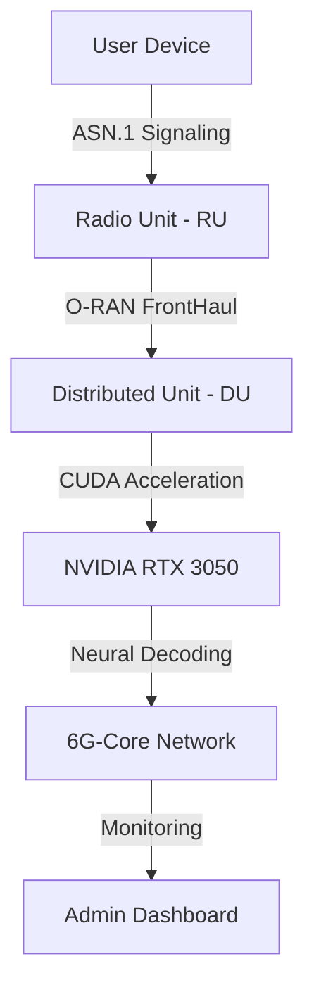

# 🧬 Kolam-6G: Post-Quantum Geometric Telecom Lab

-orange)


**Kolam-6G** is a state-of-the-art Research & Development platform that bridges ancient geometric art (Kolam) with the future of telecommunications: **3GPP Release 19 (6G)**. This project transforms geometric patterns into high-entropy "Radio DNA" to drive secure, collision-free, and quantum-immune 6G networks.

---

## 📋 Table of Contents

- [🚀 6G Features](#-6g-features)
- [🛡️ Proactive Defense Suite](#️-proactive-defense-suite)
- [📊 6G Admin Lab & Monitoring](#-6g-admin-lab--monitoring)
- [🛠️ Architecture (O-RAN Native)](#️-architecture-o-ran-native)
- [💻 Installation & Running](#-installation--running)
- [📖 Documentation](#-documentation)
- [📜 The Technical Manifesto](#-the-technical-manifesto)

---

## 🚀 6G Features

### 📡 1. Geometric FH-OFDMA
Traditional 5G random frequency hopping suffers from collisions. Kolam-6G uses **deterministic geometric patterns** to ensure 100% orthogonal sub-carrier allocation for millions of devices simultaneously.

### 🔦 2. Massive MIMO "Kolam Precoding"
We derive beamforming phase-shifts directly from Kolam entropy, creating "Cold Beams" that steer signals with millimeter precision without leaking energy to neighboring users.

### 👁️ 3. Integrated Sensing (ISAC Radar)
The environment is sensed using **"Kolam Probes"**. By analyzing reflections of geometric waves, the system provides high-resolution radar sensing (distance, velocity, posture) without cameras.

### 🧠 4. AI-Native Neural Receivers
Replaces standard decoders with a **Neural AI** trained to recognize and reconstruct "Kolam-distorted" signals even in environments with 90% signal destruction.

---

## 🛡️ Proactive Defense Suite

Our "Quantum Security Shield" provides immunity against next-gen threats:
- **Lattice-Based PQC**: Post-Quantum encryption derived from Kolam symmetry seeds.
- **Temporal Seed Morphing**: Geometric keys rotate every 0.1ms to prevent pattern prediction.
- **Neural Guarding**: AI-driven detection of "Structured Noise" and radio spoofing.
- **Radio Watermarking**: High-entropy digital fingerprints embedded in every ISAC probe to prevent target ghosting.
- **DMA Sandbox**: Hardware-level compute quotas on the **NVIDIA RTX 3050** to prevent VRAM flooding.

---

## 📊 6G Admin Lab & Monitoring

Access the professional command center at `/telecom-admin` (**Credentials**: `admin` / `kolam6g`):
- **FH-OFDMA Grid**: Real-time visualization of sub-carrier allocation.
- **MIMO Beam Map**: Animated tracker of spatially steered signals.
- **ISAC Radar**: Live feed of detected environmental targets.
- **Performance Analytics**: Time-series graphs for Throughput (Gbps) and Spectral Efficiency (bps/Hz).
- **Security Drill Center**: Trigger simulated attacks (Neural Spoof, VRAM Flood) to verify proactive defenses.

---

## 🛠️ Architecture (O-RAN Native)



- **Frontend**: React 18 + Recharts + Framer Motion (Optimized for Mobile/Desktop).
- **Backend**: Python 3.12 + NumPy + FastAPI.
- **Hardware Bridge**: Simulated **NVIDIA CUDA C++ Bridge** for the Ampere 8.6 architecture.

---

## 💻 Installation & Running

### 1. Zero-Config Run (Recommended)
```bash
npm run dev:all
```
This starts the **Vite Frontend (Port 8080)** and the **FastAPI Backend (Port 8081)** concurrently.

### 2. Manual Start
**Frontend:**
```bash
npm run dev
```
**Backend:**
```bash
python backend/run_backend.py
```

---

## 📖 Documentation

*   [**KOLAM_IN_TELECOM.md**](docs/KOLAM_IN_TELECOM.md) - Deep dive into 5 key Kolam integrations.
*   [**KOLAM_SECURITY_HARDENING.md**](docs/KOLAM_SECURITY_HARDENING.md) - Definitive guide to our proactive defense suite.
*   [**HARDWARE_INTEGRATION_GUIDE.md**](docs/HARDWARE_INTEGRATION_GUIDE.md) - Roadmap for SDR/FPGA deployment.
*   [**TELECOM_LAB_PILLARS.md**](docs/TELECOM_LAB_PILLARS.md) - Theoretical core of the 6G Lab.

---

## 📜 The Technical Manifesto

We believe that the future of global connectivity is not just "Faster Data," but **"Geometric Truth."** By using Kolam-FHSS, we turn the chaotic radio spectrum into a perfectly ordered grid, making the 6G-Standard more secure, more efficient, and inherently private.

---

**Kolam-6G Lab // Classified Intelligence // v3.5 Stable**