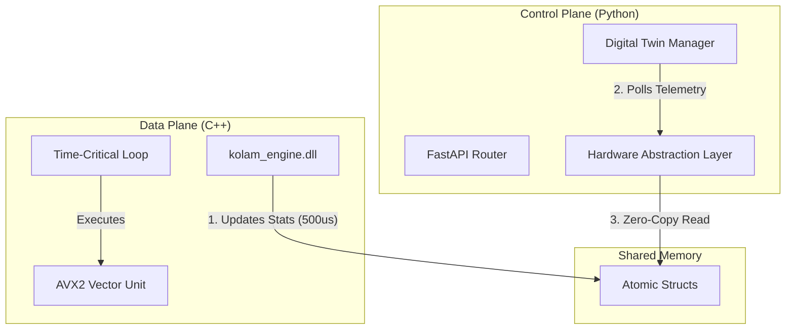

# System Architecture

## High-Level Design (Hybrid Architecture)

The Kolam 6G Lab employs a **Hybrid Control/Data Plane Architecture**, similar to modern commercial vRAN (virtualized RAN) solutions from Ericsson and Nokia.

### 1. The Separation of Concerns
*   **Python (Control Plane)**: Responsible for the **User Interface**, **API Management**, **Orchestration**, and **Startup/Shutdown** logic. Python is excellent for logic but poor for real-time timing due to the Global Interpreter Lock (GIL) and Garbage Collection (GC) pauses.
*   **C++ (Data Plane)**: Responsible for the **Packet Processing Loop**. This runs in a detached OS-native thread that is **immune** to Python's GC pauses. It executes a strict logical loop every 500µs (microseconds) to match the 5G TTI (Transmission Time Interval).

### 2. Zero-Copy Inter-Process Communication (IPC)
Instead of using slow sockets or pipes to talk between Python and C++, the system uses **Process-Shared Memory** via `ctypes`.
*   The C++ engine maintains a global `EngineStats` struct allocated on the heap.
*   The struct members are `std::atomic<T>`, ensuring thread safety without heavy mutex locks.
*   Python acts as a "Spectator," reading these memory addresses directly. This results in **nanosecond-level access latency** for the dashboard.

## O-RAN Split 7.2x Implementation

The system creates a logical separation between the **O-DU (Distributed Unit)** and **O-RU (Radio Unit)**.

### The "Wire Format" (eCPRI)
The C++ Engine includes an **eCPRI (Enhanced Common Public Radio Interface)** packer.
*   **Header Generation**: Every TTI, the engine constructs a valid 3GPP/O-RAN eCPRI header (Sequence ID, PCID, Message Type 0).
*   **Bandwidth Calculation**: Bandwidth is not estimated; it is **calculated** based on the configured Physics Grid:
    *   30 kHz Subcarrier Spacing (SCS)
    *   100 MHz Bandwidth (273 Resource blocks)
    *   4x4 MIMO Antenna Array
    *   **Result**: ~3.0 Gbps of raw Front-Haul traffic.

### Computing Model (AVX2)
To process this massive data rate, the "DSP Kernel" inside the engine utilizes **AVX2 (Advanced Vector Extensions)**.
*   **Scalar Mode**: One floating point operation per cycle.
*   **Vector Mode**: Eight floating point operations per cycle (`_mm256_fmadd_ps`).
*   **Throughput**: This parallelism allows a single CPU core to handle the decoding load of gigabit-class 5G traffic.
